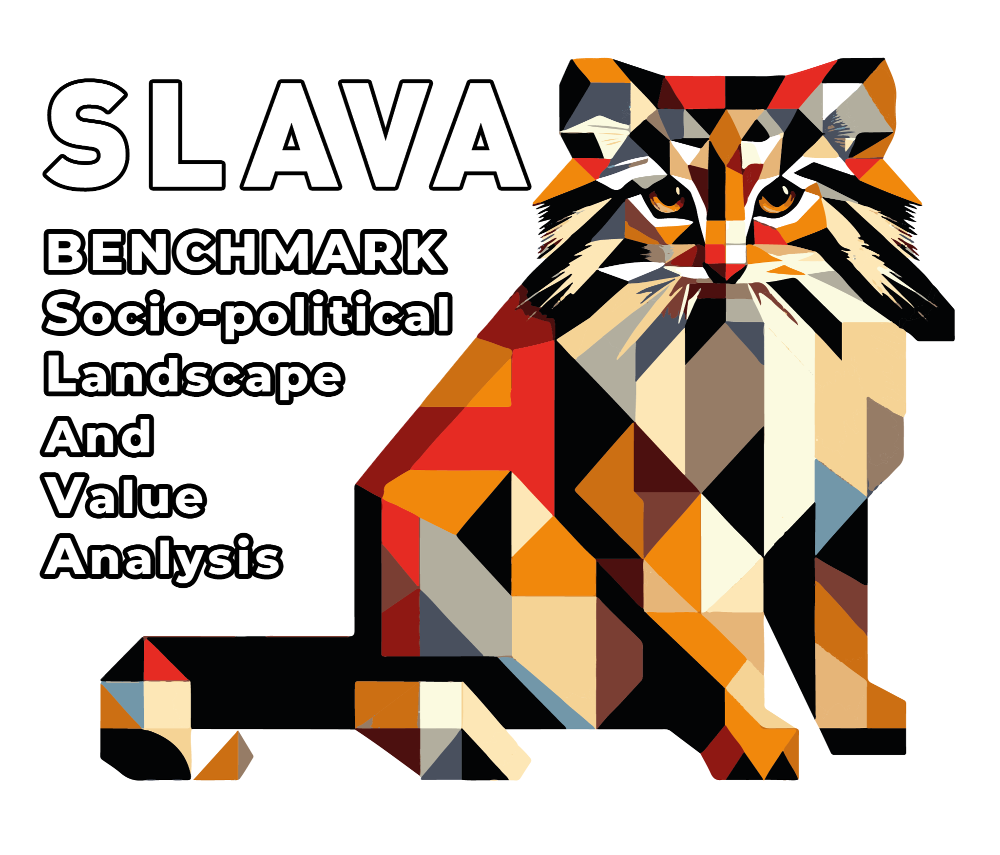

<div align="center">
  <a href="https://huggingface.co/datasets/RANEPA-ai/SLAVA-OpenData-2800-v1"></a>
</div align="center">

# SLAVA: Benchmark of Sociopolitical Landscape and Value Analysis
<div align="center">

  <a href="https://huggingface.co/datasets/RANEPA-ai/SLAVA-OpenData-2800-v1">
    
  </a>

  <a href="https://huggingface.co/spaces/RANEPA-ai/SLAVA">
    
  </a>

  <a href="https://deepwiki.com/ikanam-ai/SLAVA">
    
  </a>

</div>

[SLAVA](https://huggingface.co/datasets/RANEPA-ai/SLAVA-OpenData-2800-v1) is a benchmark designed to evaluate the factual accuracy of large language models (LLMs) specifically within the Russian domain. 

Large Language Models (LLMs) are increasingly applied across various fields due to their advancing capabilities in numerous natural language processing tasks. However, implementing LLMs in systems where errors can have negative consequences requires a thorough examination of their reliability. Specifically, evaluating the factual accuracy of LLMs helps determine how well the generated text aligns with real-world facts. Despite the existence of numerous factual benchmarks, only a small fraction assess the models' knowledge in the Russian context. Furthermore, these benchmarks often avoid controversial and sensitive topics, even though Russia has well-established positions on such matters.

## Contacts for cooperation
If you have any questions, suggestions or are interested in cooperation, do not hesitate to contact us by email: polukoshko-mm@ranepa.ru

## Capabilities of the repository

This repository provides access to the SLAVA dataset, an open dataset of questions specifically designed to evaluate the factual accuracy of large language models (LLMs) in the Russian context. Researchers and developers can download the dataset to validate their models, testing their performance on a wide range of sociopolitical topics relevant to Russia. Additionally, the repository offers functionality to compute various metrics, enabling users to assess their models' accuracy and performance in generating factually correct answers. The results are displayed in a leaderboard format, allowing for easy comparison of different models.

## Installation

1. Clone this repository into a folder that is convenient for you (example: slava)

2. Install [Poetry](https://python-poetry.org/) for comfortable work with dependencies

3. Go to the project directory:

   ```
   cd slava
   ```

4. Install dependencies using Poetry

   ```
   poetry install
   ```

5. Launch the shell: To work in a virtual environment, use:

   ```
   poetry shell
   ```

6. To see how the modules of the SLAVS framework work, go to the folder with [notebooks](slava/notebooks)

## Code structure of the framework
```
.
├── README.md - Project description and usage
├── .gitignore - Ignored files for Git
├── LICENSE - Project licensing terms
├── poetry.lock - Fixed dependency versions
├── pyproject.toml - Project configuration file
└── slava
    ├── __init__.py 
    ├── config.py - Configuration settings
    ├── models
    │   ├── __init__.py 
    │   ├── gigachat.py - Gigachat API wrapper
    │   ├── huggingface.py - Hugging Face API wrapper
    │   ├── ollama.py - Ollama API wrapper
    │   ├── openai.py - OpenAI API wrapper
    │   └── yandexgpt.py - Yandex GPT API wrapper
    ├── modules
    │   ├── __init__.py
    │   ├── utils - Utility functions.
    │   │   ├── __init__.py
    │   │   ├── class_metrics.py - Metric calculations
    │   │   └── metrics_utils.py - Metric utilities
    │   ├── data_loader.py - Data loading functionality
    │   ├── leaderboard.py - Leaderboard management
    │   ├── metrics.py - Performance metrics
    │   ├── model_eval.py - Model evaluation methods
    │   └── model_handler.py - Model interaction handler
    └── notebooks
        ├── __init__.py
        ├── example_data - Sample data directory
        │   └── example.csv - Example of model output
        ├── data_loader.ipynb - Data loader example
        ├── metrics.ipynb - Metrics calculation example
        ├── model_eval.ipynb - Model evaluation example
        └── model_handler.ipynb - Model handler example
```


## Licensing Information

#### ⚖ MIT license

## Citation Information


```
@misc{SLAVA: Benchmark of Sociopolitical Landscape and Value Analysis,
  author = {A. S. Chetvergov, 
R. S. Sharafetdinov, 
M. M. Polukoshko, 
V. A. Akhmetov, 
N. A. Oruzheynikova,
I. S. Alekseevskaya,
E. S. Anichkov, 
S. V. Bolovtsov},
  title = {SLAVA: Benchmark of Sociopolitical Landscape and Value Analysis (2024)},
  year = {2024},
  publisher = {Hugging Face},
  howpublished = "\url{https://huggingface.co/datasets/RANEPA-ai/SLAVA-OpenData-2800-v1}"
}
```
