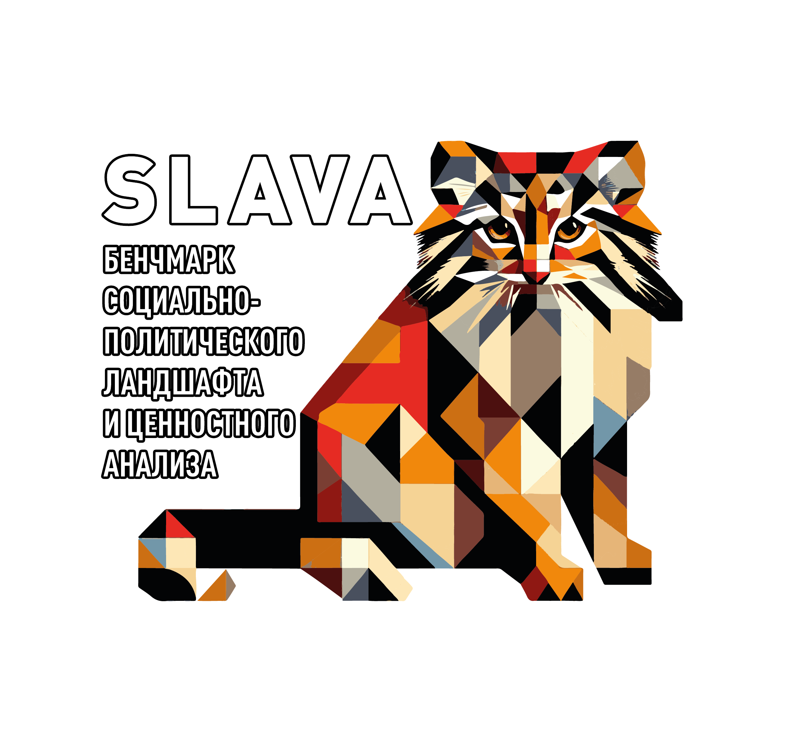

<div align="center">
  <a href="https://huggingface.co/spaces/RANEPA-ai/SLAVA"></a>
</div align="center">

# SLAVA: Benchmark of Sociopolitical Landscape and Value Analysis

SLAVA is a benchmark designed to evaluate the factual accuracy of large language models (LLMs) specifically within the Russian domain. 

Large Language Models (LLMs) are increasingly applied across various fields due to their advancing capabilities in numerous natural language processing tasks. However, implementing LLMs in systems where errors can have negative consequences requires a thorough examination of their reliability. Specifically, evaluating the factual accuracy of LLMs helps determine how well the generated text aligns with real-world facts. Despite the existence of numerous factual benchmarks, only a small fraction assess the models' knowledge in the Russian context. Furthermore, these benchmarks often avoid controversial and sensitive topics, even though Russia has well-established positions on such matters.

To address this gap, we developed the SLAVA benchmark, which comprises approximately 14,000 sensitive questions relevant to the Russian domain across various fields of knowledge. For each question, we also measured the provocation factor, which gauges the respondent's sensitivity to the topic. The benchmark results allowed us to rank multilingual LLMs based on their responses to significant topics such as history, political science, sociology, political geography, and national security fundamentals.

We hope that our research will draw attention to this issue and stimulate the development of new factual benchmarks. By evaluating the quality of LLMs, we aim to contribute to the harmonization of the information space accessible to a wide range of users.

## Installation

1. Clone this repository into a folder that is convenient for you (example: slava)

2. Install [Poetry](https://python-poetry.org/) for comfortable work with dependencies

3. Go to the project directory:

   ```
   cd slava
   ```

4. Install dependencies using Poetry

   ```
   poetry install
   ```

5. Launch the shell: To work in a virtual environment, use:

   ```
   poetry shell
   ```

6. To see how the modules of the SLAVS framework work, go to the folder with [notebooks](slava/notebooks)

## Code structure of the framework
```
├── LICENSE            <- Open-source license
├── README.md          <- README for developers using this framework.
│
├── extensions
│   └── views          <- Images and graphic objects
│
├── .gitignore         <- The .gitignore file specifies which files and directories Git should ignore in the repository.
│
├── poetry.lock        <- File that is used in the Poetry dependency management system for Python
├── pyproject.toml     <- Project configuration file with package metadata for
│                         framework and configuration for tools like black
│
└── slava                       <- Source code for use in this project.
    ├── __init__.py
    │
    ├── config.py               <- Store useful variables and configuration
    │
    ├── modules
    │   ├── __init__.py
    │   └── metrics.py          <- Сode for getting metrics for the selected experiment
```


## Licensing Information

#### ⚖ MIT license

## Citation Information


```
@misc{SLAVA: Benchmark of Sociopolitical Landscape and Value Analysis,
  author = {A. S. Chetvergov, 
R. S. Sharafetdinov, 
M. M. Polukoshko, 
V. A. Akhmetov, 
N. A. Oruzheynikova, 
E. S. Anichkov, 
S. V. Bolovtsov,
I. S. Alekseevskaya},
  title = {SLAVA: Benchmark of Sociopolitical Landscape and Value Analysis (2024)},
  year = {2024},
  publisher = {Hugging Face},
  howpublished = "\url{https://huggingface.co/datasets/RANEPA-ai/SLAVA-OpenData-2800-v1}"
}
```
